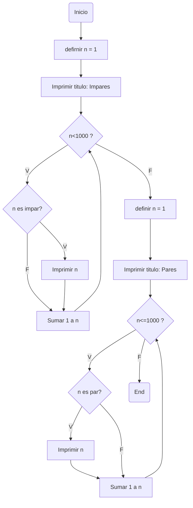
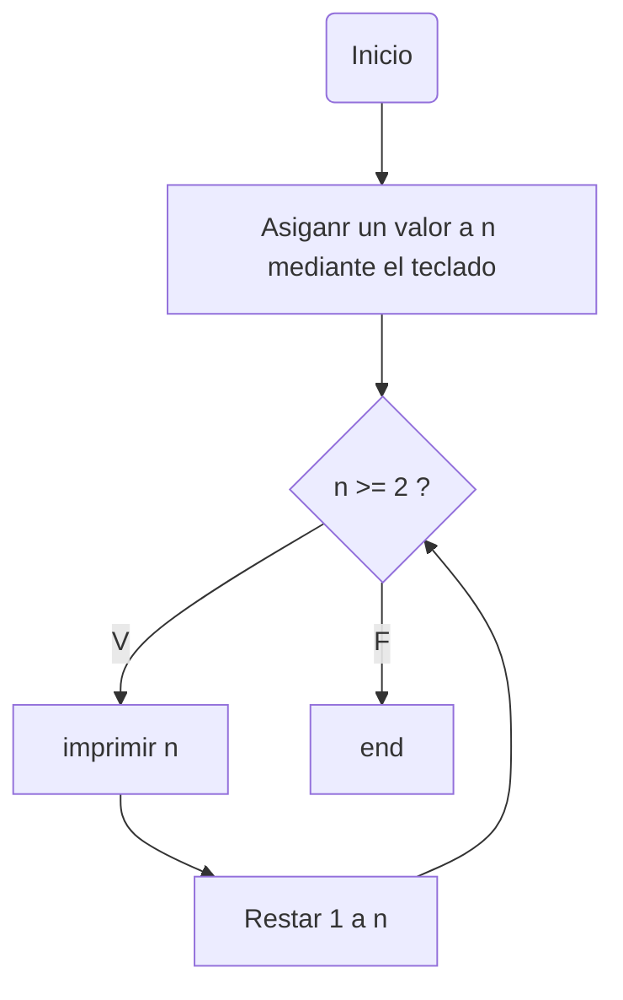

# Bucles-R6
Retos con bucles tipo while

Se invita al usario a probar los codigos en un interprete como colab si desea echar un vistaso las salidas de los codigos o desea probar distintos valores, se avisa que algunas salidas son bien largas
## Retos propuestos
### 1. Imprimir un listado con los números del 1 al 100 cada uno con su respectivo cuadrado
#### Diagrama de flujo

#### Programa
```python
n=1
print("Orden:\nNumero -> Numero**2\n")
while n<=100:
  print(n,n**2)
  n+=1
```
### 2. Imprimir un listado con los números impares desde 1 hasta 999 y seguidamente otro listado con los números pares desde 2 hasta 1000
#### Diagrama de flujo

#### Programa
```python
n=1
print("Impares\n")
while n<1000:
  if n%2 != 0:
    print(n)
  n+=1
n=1
print("\nPares\n")
while n<=1000:
  if n%2 == 0:
    print(n)
  n+=1
```
### 3. Imprimir los números pares en forma descendente hasta 2 que son menores o iguales a un número natural n ≥ 2 dado
#### Diagrama de flujo

#### Programa
```python
n=int(input("ingresa un numero: "))
while n>=2:
  if n%2 == 0:
    print(n)
  n-=1
```
### 4. Imprimir el factorial de un número natural n dado
#### Programa
```python
if __name__=="__main__":
  num=int(input("Ingresa un numero "))
  v2=1
  acumulado=1

  while True:
    if num >= v2:
      acumulado=v2*acumulado
      v2+=1
    else:
      break
  print(str(num)+"! es:", acumulado)
```
Ingresa 5 salida deseada 120
#### Pseudocodigo
Con este me trabe un poco asi que plantee en un bloc de notas como deberia actuaria el programa (en este caso fue con el 4 pero el programa de arriba sirve con cualquier numero)
```python
a*b=acumulado
1*1=1
b==4? no
se guarda acumulado=1
1*2=2
b==4? no
se guarda acumulado=2
2*3=6 
b==4? no
se guarda acumulado=6
6* 4=24
b==4? si
se guarda acumulado=24 y se rompe el bucle
Fatorial = acumulado 24
```
### 5. Implementar un programa que ingrese un número de 2 a 50 y muestre sus divisores.
#### Programa
```python
numero_e=int(input("Tngresa un numero de entre 2 y 50 "))
posible_div=1
if numero_e>2 and numero_e<50:
  print("los divisores de",numero_e,"son:")
  while posible_div <= numero_e:
    if numero_e % posible_div==0:
      print(posible_div)
    posible_div+=1
else:
  print("Tu numero no entra en los limites establecidos")
```
Ingresa 12 salida deseada:


1

2

3

4

6

12
