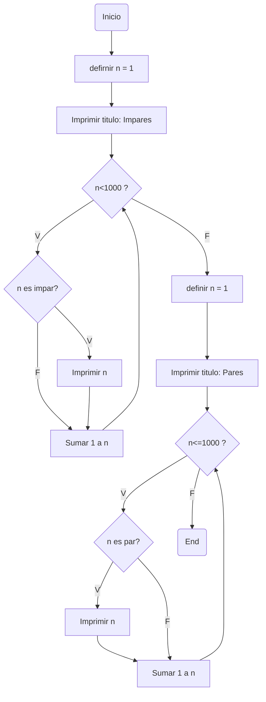
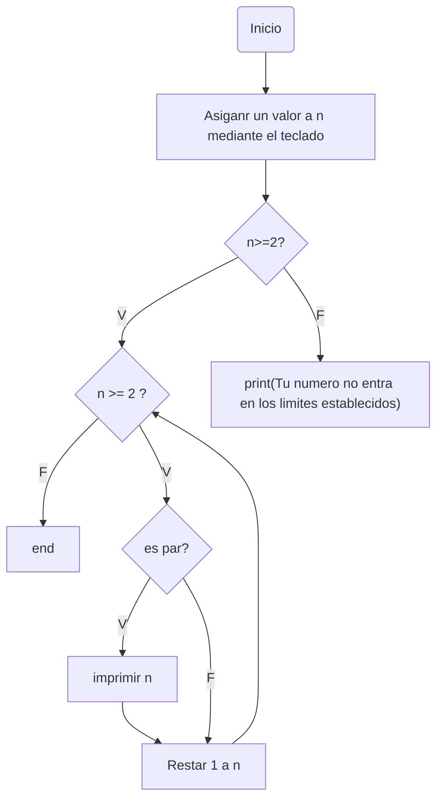

# Bucles-R6
Retos con bucles tipo while

Los codigos fueron comprobados y son funcionales pero se invita al usario a probar los codigos en un interprete como colab si desea echar un vistaso las salidas de los programas o desea probar distintos valores (en caso que se pueda), se avisa que algunas salidas son bien largas
## Retos propuestos
### 1. Imprimir un listado con los números del 1 al 100 cada uno con su respectivo cuadrado
#### Diagrama de flujo

#### Programa
```python
n=1
print("Orden:\nNumero -> Numero**2\n") #Unicamente para guiar al usuario a saber cual es cual
while n<=100:
  print(n,n**2) #imprime numero y numero al cuadrado
  n+=1
```
**Salida generada:** **muy extensa (ejecutar en interprete si desea ver resultados)*
### 2. Imprimir un listado con los números impares desde 1 hasta 999 y seguidamente otro listado con los números pares desde 2 hasta 1000
#### Diagrama de flujo

#### Programa
```python
n=1
print("Impares\n") #Titulo que se imprimira
while n<1000: #el bucle se rompe hasta cuando n tiene valor 1000
  if n%2 != 0: #Verifica si el numero es impar
    print(n)
  n+=1
n=1
print("\nPares\n") #Titulo que se imprimira una vez finalizado el primer bucle
while n<=1000: el bucle se rompe hasta cuando n tiene valor 1001
  if n%2 == 0: #Verifica si el numero es par
    print(n)
  n+=1
```
**Salida generada:** **muy extensa (ejecutar en interprete si desea ver resultados)*

### 3. Imprimir los números pares en forma descendente hasta 2 que son menores o iguales a un número natural n ≥ 2 dado
#### Diagrama de flujo

#### Programa
```python
n=int(input("ingresa un numero >=2 : "))
if n>=2:
  while n>=2:
    if n%2 == 0:
      print(n, end=" ")
    n-=1 #esto asegura que sea descendiente
else:
  print("Tu numero no entra en los limites establecidos")
```
Ingresa 6 salida generada: 6 4 2


Ingresa 5 salida generada: 4 2


Ingresa -2 salida generada: Tu numero no entra en los limites establecidos
### 4. Imprimir el factorial de un número natural n dado
#### Programa
```python
if __name__=="__main__":
  num=int(input("Ingresa un numero: "))
  v2=1 #a este se le sumara +1 por ciclo
  acumulado=1 #este sera el factorial que se imprimira al final
  while True: #es la manera mas sencilla de hacer un bucle indefinido :P
    if num >= v2: #este es el limite indirectamente
      acumulado=v2*acumulado #Lo explico en el pseudocodigo de abajo
      v2+=1
    else:
      break
  print(str(num)+"! es:", acumulado) #esto es unicamente para una salida "elegante" y visualmente entendible
```
Ingresa 4 salida generada: 4! es: 24


Ingresa 5 salida generada: 5! es: 120


Ingresa 8 salida generada: 8! es: 40320
#### Pseudocodigo
Con este reto me confundi un poco asi que plantee en un bloc de notas de como actuaria el programa y la salida que daria (en este caso fue con el 4 pero el programa de arriba sirve con cualquier numero)
```python
a*b=valor a guardar en acumulado
1*1=1
b==4? no
se guarda acumulado=1
1*2=2
b==4? no
se guarda acumulado=2
2*3=6 
b==4? no
se guarda acumulado=6
6*4=24
b==4? si
se guarda acumulado=24 y se rompe el bucle
Fatorial = acumulado 24
```
### 5. Implementar un programa que ingrese un número de 2 a 50 y muestre sus divisores.
#### Programa
```python
numero_e=int(input("Tngresa un numero de entre 2 y 50 "))
posible_div=1
if numero_e>2 and numero_e<50: #verifica si la condicion es cumplida
  print("los divisores de",numero_e,"son:")
  while posible_div <= numero_e: #EL bucle se rompe cuando el numero que dividira sea >numero_e
    if numero_e % posible_div==0: #verifica si "posible_div" es divisor del numero
      print(posible_div, end=" ") #de serlo imprimira el numero y ademas lo imprimira seguido
    posible_div+=1
else:
  print("Tu numero no entra en los limites establecidos") #no se cumplio la condicion
```
Ingresa 12 salida generada: 1 2 3 4 6 12


Ingresa 1 salida generada: Tu numero no entra en los limites establecidos
### 6. Implementar el algoritmo que muestre los números primos del 1 al 100.
#### Funcion definida y su explicacion
```python
def sera_primo(numero):
  #Las condiciones a comprobar:
  if numero<0: #Un numero primo es mayor que cero
    return False #salida que se dara si se cumple esta condicion
  v2=2 #se le sumara +1 por ciclo
  while v2 <= numero**0.5: #Es una mausquerramienta que nos ayudara mas tarde, explicacion abajo
    if numero % v2 ==0: #Revisara si el numero resulta tener algun divisor distinto de 1 y el mismo 
      return False # salida que se dara si se cumple esta condicion con algun numero
    v2 += 1
  return True #Si ninguna condicion resulta ser cierta esta sera la salida
```
**Mausquerramienta:** Pense en utilizar todos los valores menores que el numero ingresado, pero al solo comprobar si su raiz cuadrada es divisible por algun numero menor o igual a esta significara que ese numero por el que se dividio tambien es divisor del numero original lo que significara que no es un numero primo
#### Programa
```python
def sera_primo(numero):
  if numero<0: 
    return False 
  v2=2
  while v2 <= numero**0.5: 
    if numero % v2 ==0: 
      return False
    v2 += 1
  return True
if __name__=="__main__":
  #iniciaremos desde el 2 ya que el 1 no cuenta como primo
  contador=2 #a este se le sumara +1 por ciclo
  while contador<=100: #el bucle se rompe cuando contador sea >100
    respuesta=sera_primo(contador) #Esta operacion revisara si el numero actual es primo
    if respuesta==True: #Salida True, el numero es primo
      print(contador, end=" ") #de serlo lo imprime
    contador += 1
```
Salida generada: 2 3 5 7 11 13 17 19 23 29 31 37 41 43 47 53 59 61 67 71 73 79 83 89 97 
