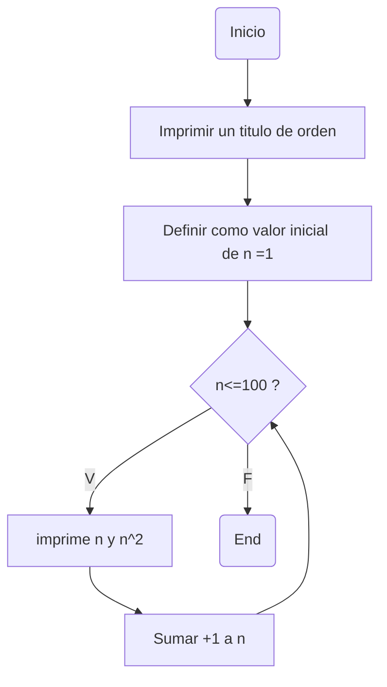

# Bucles-R6
Retos con bucles tipo while
## Retos propuestos
### 1. Imprimir un listado con los números del 1 al 100 cada uno con su respectivo cuadrado
#### Diagrama de flujo

#### Programa
```python
n=1
print("Orden:\nNumero -> Numero**2\n")
while n<=100:
  print(n,n**2)
  n+=1
```
### 2. Imprimir un listado con los números impares desde 1 hasta 999 y seguidamente otro listado con los números pares desde 2 hasta 1000
### 3. Imprimir los números pares en forma descendente hasta 2 que son menores o iguales a un número natural n ≥ 2 dado
###
